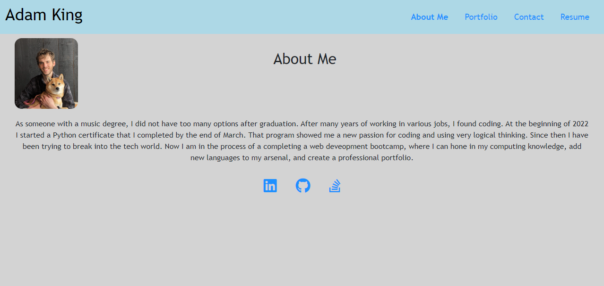

# Adam King's Web Development Portfolio

## Table of Contents
-[Description](#description)  
-[Installation](#installation)  
-[Usage](#usage)  
-[Contributing](#contributing)    
-[Credits](#credits)  
-[License](#license)  
-[Questions](#questions)

## Description
For the last five months I have been enrolled in a web development bootcamp through Uconn and EdX. This application was created to showcase my work as a web development student to prospective employers and colleagues. There is an "About Me" page with a short description of myself with a picture. There is a "Portfolio" page that displays six of my projects. There is a "Contact" page that displays a form to fill out if someone wants to contact me. There is also a "Resume" page that lists my development skills and has my downloadable resume. This project makes use of Node.js, Express.js, React.js, Bootstrap, and Vite.

## Installation
There is no installation needed to run this deployed application. All you need to do is go to the url and the functioning app will render.

## Usage
To use the application, go to the url [HERE](https://main--kingadam-portfolio.netlify.app/). When the app loads, the "About Me" page will render. You will see a header with a navbar and a footer that stays on the screen when different pages are loaded. The about me page has my picture and a short description of myself. Click on the "Portfolio" title in the navbar and the page that has my projects will render. Click on the title of a project to view its deployed page, and click on the github icon to view the github repository for that project. Some projects are back-end only, so their links to the deployed site will bring you to their github repo. Click on the "Contact" title in the navbar to render the contact page. The contact page will display a form that has inputs for your name, email, and a message. If you click into any of these fields and then click out without adding text, an error message will show up at the bottom of the form. When you click on the "Resume" title on the navbar, my resume page will render. There will be a downloadable resume link at the top of the page, and then a list of my front-end and back-end skills underneath. In the footer, there are three links. The github icon opens my github profile, the linkedin icon loads my linkedin profile, and the stackoverflow icon loads my stackoverflow profile.

## Contributing
To contribe, fork the project, create a branch to work on, edit that branch, and then create a pull request. If the edits are approved, your contributions will be added.

## Credits
This code makes references from a Uconn web development bootcamp in the following repo: https://git.bootcampcontent.com/. The documentation for express, node, react, vite, bootstrap, and mdn were also used as references.

## License
This project is not protected under any license.

## Questions
To view more of my work, view my GitHub profile: [adaking1](https://github.com/adaking1)

If you have any questions about this project please email me here: kinga1215@yahoo.com

